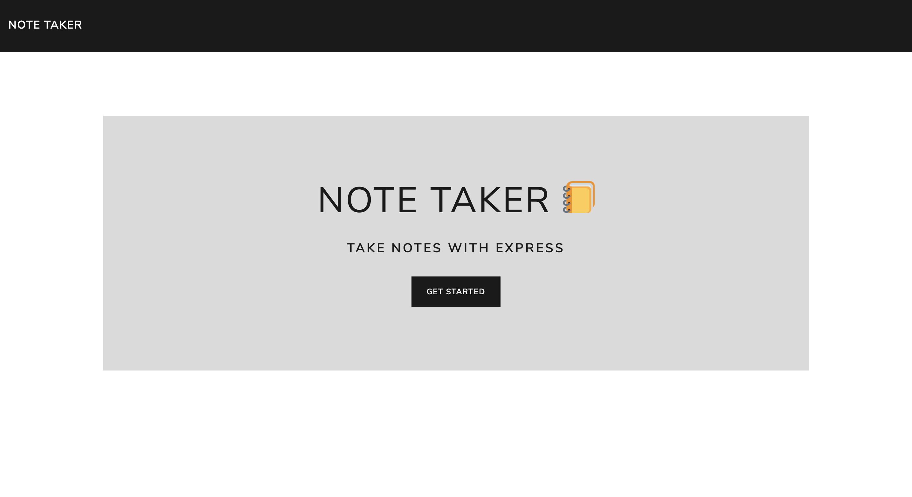

# Notiker: An Express Note Taking App

## Description

This application can be used to write, save, and delete notes. This NodeJS application uses an Express backend to save and retrieve note data.

The application is deployed and hosted on Heroku from this GitHub repo. The live page can be viewed here: https://notiker.herokuapp.com/

## Features

*AS A user, I want to be able to write and save notes*

*And I WANT to be able to delete notes I've written before*

*SO THAT I can organize my thoughts and keep track of tasks I need to complete*

The application allow users to create and save notes, view previously saved notes, and delete previously saved notes.

The lorem ipsum for the first few notes are quotes from Carl Sagan thanks to [Sagan Ipsum](http://saganipsum.com/).

## Technology and Methodology

This NodeJS application uses an Express backend to save and retrieve note data from a JSON file with the following HTML routes:

* GET `/notes` - returns the `notes.html` file

* GET `*` - also returns the `index.html` file

The application has a `db.json` file on the backend used to store and retrieve notes using the Express method `res.sendFile`.

The application uses the following API routes:

* GET `/api/notes` - reads the `db.json` file and returns all saved notes as JSON

* POST `/api/notes` - receives a new note to save on the request body, adds it to the `db.json` file, and then returns the new note to the client

* DELETE `/api/notes/:id` - receives a query parameter containing the id of a note to delete. This means each note has a unique `id` when it's saved. In order to delete a note, all notes are read from the `db.json` file, and the note with the given `id` property is removed.